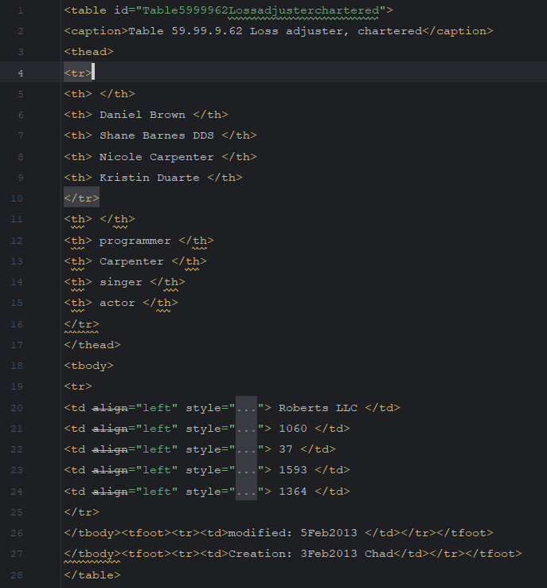
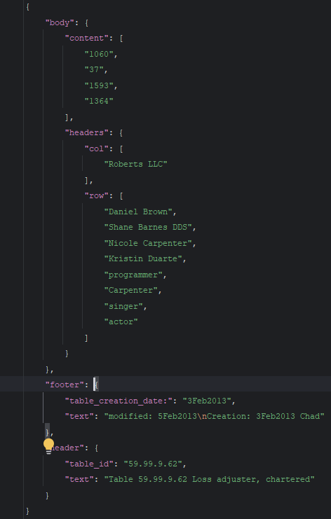
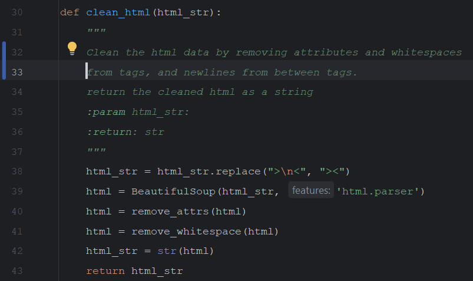
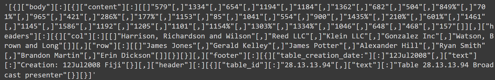
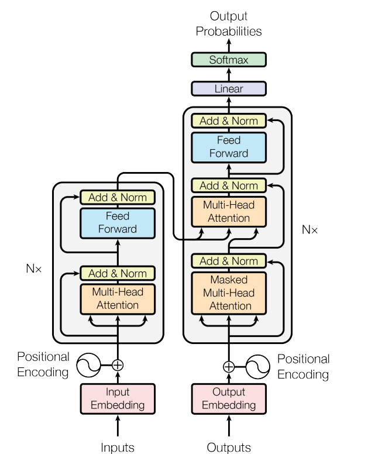

# Character Based Neural Machine Translation
## Introduction
### Problem formulation
Given an HTML Table, generate a JSON object that represents the table.
The table html table and json structures are defined by 30K pair samples and is not giver explicitly.
The solution should be generalizable to any table and json structure that is defined by the dataset.

### Data Exploration
The dataset contains 30K samples of HTML tables and their corresponding JSON objects.

**HTML table example:**



**JSON object example:**



From observing few examples of html and json pairs, we learn that:
1. The html table can have multiple rows and columns.
2. The attributes in the html tables are not required for generating the json object.
3. Some of the values in the json are not a simple "copy-paste" from the html table
but are a substring of values in the html table.
4. The json object does not follow the same order of the html table.
For example, the header is at the end of the json object. New data may not follow this pattern.

### Challenges
These properties of the data raises two main challenges:
1. To support dynamic html and json structures the model should be able to learn the structure of the html table and json
automatically and directly from examples.
2. The model should be able to learn the substring relationship between the html table and json object.

### Approach
I propose a character based neural machine translation model to solve this problem.
The model is trained on the 30K examples of html and json pairs.
The model is trained to generate the json object from the html table.
The reason for using a character based model is twofold:
1. The model should be able to learn the substring relationship between the html table and json object
but also their structure.
2. The nature of the data is sparse, tables holds numerical values which may not repeat often and will create
a large vocabulary, which is not ideal for this kind of approach.


## Character Based Neural Machine Translation

### Data Preprocessing

I removed the attributes from the html table and only keep the values.
Trailing and leading whitespaces are removed from the values as they are not found in the json object.
New lines between html tags are removed as they have no meaning in the json object.



### Tokenization
The model uses character based tokenizer for each of the html table and json object.
1. The html tokenizer adds special tokens for each of the html tags (both opening and closing tags) i.e \<table> and \</table>.
2. The json tokenizer adds special tokens for each of the json keys but also for the json
"structural" tokens i.e "{", "}", ",".
In order to differentiate between structural tokens and regular tokens, I added square brackets
around the structural tokens. 
3. Both tokenizers tokenized the characters in the values of the html table and json object.
4. We used a character based tokenizer from https://github.com/dariush-bahrami/character-tokenizer
for both of the tokenizers.

### Model Architecture
The model is a sequence to sequence model with transformer architecture.
The reason for using transformer and not RNN is to avoid common problems with RNNs like vanishing/exploding gradients
and the information bottleneck in RNN seq2seq models.

*Vaswani, A. "Attention is all you need." Advances in Neural Information Processing Systems (2017).*

**Model hyperparameters**:
```python
EMB_SIZE = 256
NHEAD = 8
FFN_HID_DIM = 4096
BATCH_SIZE = 32
NUM_ENCODER_LAYERS = 1
NUM_DECODER_LAYERS = 1
```
**Training**: The model is trained on 80% of the dataset (24K samples) and validated on 20% of the dataset (6K samples).
**Training hyperparameters**:
```python
LR = 0.001
EPOCHS = 40
```
### Generation 
In order to generate the json object from the html table, the model uses the following steps:
1. The html table is tokenized using the html tokenizer and passed through the encoder.
2. The encoder output is passed through the decoder along with the start token.
3. The decoder generates the json object character by character.

I implemented 2 generation methods:
1. **Greedy generation**: The model generates the json object character by character using the most probable character.
2. **Beam search generation**: The model generates the json object using beam search.

### Evaluation: The model is evaluated on the BLEU score.
The validation loss (Categorical CrossEntropy) is 0.0009 which is good.
The BLEU score is 0.98 which is also very good.

## Future Improvements
1. Using libraries like jsonRepair to validate the generated json object structure.
2. Training a model that generated only the structure of the json and then use separate models to generate the values.
3. Fine-tuning the model hyperparameters to improve model robustness.
4. Add a loss function that penalizes the model for generating a wrong json structure.
5. Adding data augmentation techniques to improve the model generalization.
